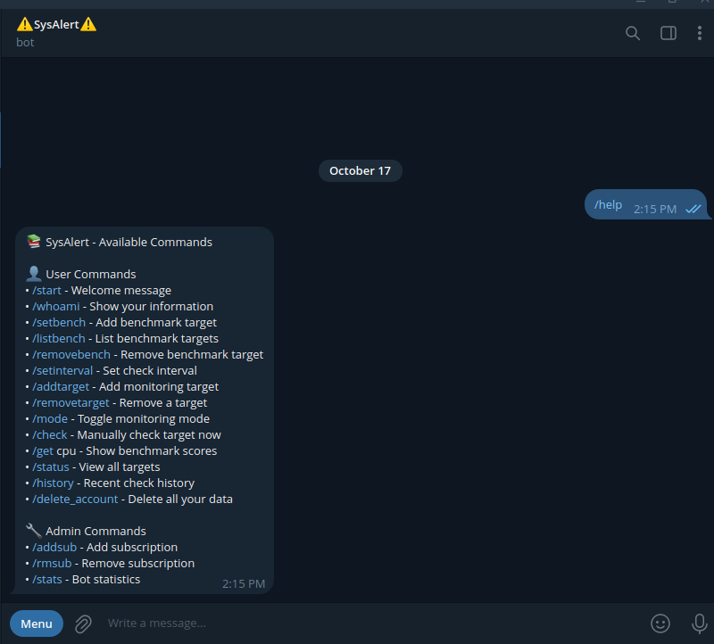
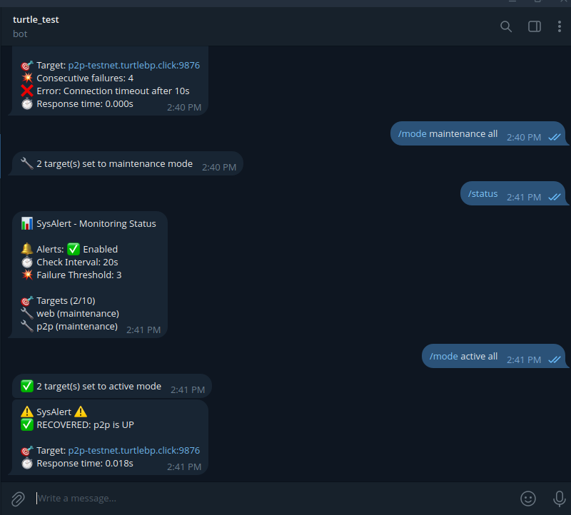

# 🚨 SysAlert Monitor Bot v2

**Your intelligent Telegram monitoring companion** for production systems — built with enterprise-grade encryption, configurable benchmarks, and flexible target management.

> **🎉 What’s New:** A more secure, configurable, and production-hardened release.  
> Now supports benchmark customization, encryption key rotation, and fine-grained maintenance mode control.

---

## 🧭 Overview

**SysAlert Monitor Bot v2** is a **Telegram-based system monitoring assistant** designed for developers, sysadmins, and block producers.  
It continuously checks server uptime, connection stability, and performance metrics — directly from Telegram.

The bot can operate in **two modes**:

1. **🛠️ Self-Hosted Mode**
   - Deploy it on your own infrastructure.
   - Full control, **unlimited** benchmark and monitoring targets.
   - Ideal for validators, enterprise setups, or private deployments.

2. **☁️ Hosted by Us**
   - Use our hosted instance — no setup required.
   - Just message [@trutle_sleep](https://t.me/turtle_sleep) to be added as a subscriber.
   - Benchmark targets are limited to **3**, and monitoring targets are limited to **5**.

> ⚙️ *The benchmark targets are configurable.  
> But if you don’t self-host this bot (i.e. hosted by us), you can only set up to **3 benchmarks** and **5 monitoring targets.***

---

## ⚙️ Key Features

| Category | Description |
|-----------|-------------|
| 🔐 **Privacy by Design** | AES-GCM encryption + HMAC-SHA256 fingerprints for every target |
| 🎯 **Per-User Benchmarks** | Custom performance baselines per chat ID |
| 🔄 **Key Rotation** | Re-encrypt all stored data without downtime |
| 📡 **Smart Monitoring** | TCP reachability checks, CPU benchmark, history tracking |
| 🧪 **Production Ready** | CI/CD integrated, fully tested via GitHub Actions |
| 🧩 **Modular Architecture** | Separated core logic: `commands/`, `services/`, `utils/`, `db/` |
| 🔒 **Security Hardened** | Input validation, non-root containers, least-privilege execution |
| 📊 **Encrypted Storage** | Every record stored encrypted at rest — no plaintext ever |

---

## 🧱 Project Structure

```

SysAlert-dev/
├── 📄 bot.py                          # Main bot entry point
├── 📄 models.py                       # SQLAlchemy ORM models (Subscription, Customer, Target, etc.)
├── 📄 db.py                           # Database wrapper with AES-GCM encryption
├── 📄 rotate_keys.py                  # Key rotation utility
│
├── 📁 commands/
│   └── handlers.py                    # Telegram command handlers (/start, /help, /addtarget, etc.)
│
├── 📁 services/
│   ├── monitor.py                     # TCP connectivity monitoring service
│   ├── benchmark.py                   # CPU benchmark service
│   └── tele_queue.py                  # Async Telegram queue with rate limiting
│
├── 📁 utils/
│   ├── crypto.py                      # AES-GCM + HMAC-SHA256 encryption utilities
│   ├── security.py                    # Input validation, rate limiting
│   └── privacy_logger.py              # Safe logging for sensitive data
│
├── 📁 tests/
│   ├── conftest.py                    # pytest configuration & fixtures
│   ├── test_crypto.py                 # Encryption/decryption tests
│   ├── test_db.py                     # Database operation tests
│   ├── test_benchmark.py              # Benchmark functionality tests
│   ├── **init**.py
│
├── 📁 scripts/
│   └── bootstrap.sh                   # Database + key initialization
│
├── 📁 .github/
│   └── workflows/
│       └── ci.yml                     # CI/CD pipeline
│
├── 🐳 dockerfile                      # Docker image definition
├── 📄 docker-compose.yml              # Container orchestration
│
├── 📋 Makefile                        # Build & test automation
├── 📄 requirements.txt                # Dependencies
├── 📄 pytest.ini                      # Pytest configuration
├── 📄 alembic.ini                     # DB migration config
├── 📄 .dockerignore                   # Docker ignore rules
├── 📄 .gitignore                      # Git ignore rules
│
├── 📖 README.md                       # Project overview (this file)
├── 📖 DEPLOYMENT.md                   # Full deployment guide
├── 📖 SECURITY.md                     # Security architecture details
├── 📖 PRIVACY.md                      # Data encryption & privacy practices
├── 📖 PRIVACY_LOGGING.md              # Privacy-safe logging reference

```

> 🧩 **Note:** This README **does not include** in-depth details about **security, privacy, or deployment.**  
> For those, see:  
> - [DEPLOYMENT.md](./DEPLOYMENT.md)  
> - [SECURITY.md](./SECURITY.md)  
> - [PRIVACY.md](./PRIVACY.md)  
> - [PRIVACY_LOGGING.md](./PRIVACY_LOGGING.md)

---

## 🧠 Technical Architecture

- **Language:** Python 3.11+ (async/await)
- **Framework:** `python-telegram-bot` (async)
- **Database:** SQLAlchemy + Alembic (encrypted)
- **Encryption:** AES-GCM authenticated encryption + HMAC-SHA256 fingerprints
- **Containerization:** Docker (non-root)
- **Testing:** pytest with asyncio and CI via GitHub Actions

---

## 💬 How to Use

### Basic Commands (All Users)

| Command | Description |
|----------|-------------|
| `/start` | Welcome message |
| `/whoami` | View your Chat ID and subscription info |
| `/setbench <target>` | Set custom benchmark target |
| `/addtarget <IP:PORT>` | Add a new monitoring target |
| `/get cpu` | View current benchmark score |
| `/get <target>` | Check a specific target |
| `/status` | View all monitored targets |
| `/history` | Show monitoring history |
| `/mode <maintenance|active> <target|all>` | Toggle monitoring mode |
| `/delete_account` | Permanently delete your data |

| 📸 Preview |
|------------|
|  |

---

### Maintenance Mode

Use `/mode` to temporarily disable monitoring for maintenance:
- `/mode maintenance server1`
- `/mode maintenance all`
- `/mode active server1`
- `/mode active all`

| 📸 Example |
|------------|
|  |

---

### Administrator Commands

| Command | Description |
|----------|-------------|
| `/addsub <chat_id>` | Add a new subscriber |
| `/rmsub <chat_id>` | Remove an existing subscriber |
| `/stats` | View system statistics |

---

## 🔒 Privacy & Security

SysAlert is built with a **privacy-by-design** approach.

✅ AES-GCM encrypted targets  
✅ HMAC fingerprints (no plaintext indexing)  
✅ Key rotation support (`rotate_keys.py`)  
✅ Non-root Docker containers  
✅ Rate limiting + input validation  
✅ Zero sensitive data in logs  
✅ GDPR-compliant data deletion (`/delete_account`)

🔗 See [PRIVACY.md](./PRIVACY.md) and [SECURITY.md](./SECURITY.md) for technical specifics.

---

## 📜 License

Released under the **MIT License**.  
See [LICENSE](./LICENSE) for details.

---

## ⚠️ Important Notes

- This README is for **overview and usage** only.  
  It does **not** include:
  - Deployment steps → see [deployment](DEPLOYMENT.md)
  - Security hardening → see [security](SECURITY.md) 
  - Privacy mechanisms → see [privacy.md](PRIVACY.md)
- The **hosted version** is limited to **3 benchmark** and **5 monitoring** targets.
- For **self-hosted deployments**, there are **no limits**.

---

```
