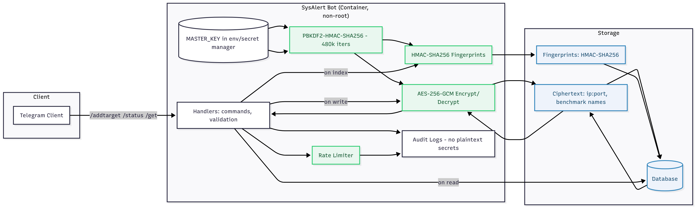

Here’s a refined, calmer [Security.md](http://Security.md) you can paste directly. I added a Mermaid diagram. For Notion, render diagrams to images if they don’t display natively.

---

# Security Architecture

A calm, privacy‑first security posture designed to minimize data exposure, contain blast radius, and keep operators in control.

## Threat model

### Protected assets

- User chat IDs and subscription status
- Monitored IP addresses and ports
- Benchmark target preferences
- Historical monitoring results and audit events

### Threats mitigated

- Database compromise via encryption at rest
- Log file exposure by avoiding plaintext secrets
- Unauthorized access through admin allowlists and strict validation
- Privilege escalation by running non‑root and reducing capabilities
- Data exfiltration with encrypted storage and minimal metadata

## Cryptographic design

### Encryption (AES‑GCM)

- Algorithm: AES‑256‑GCM
- Key derivation: PBKDF2‑HMAC‑SHA256 with 480,000 iterations
- IV/nonce: Random 12 bytes per operation
- Integrity: AEAD tag provides authenticity and integrity

### Hashing (HMAC‑SHA256)

- Purpose: Deterministic fingerprints for indexing and deduplication
- Key: Separate HMAC key derived from the master key
- Output: Hex‑encoded 256‑bit digest
- Note: Fingerprints are non‑reversible and never used as a substitute for encryption

### Key storage and rotation

- Master key: Provided via environment or secret manager only. Never stored in the database.
- Derived keys: Generated at runtime via the KDF. Not persisted.
- Rotation: Supported via scripts/rotate_[keys.py](http://keys.py) to re‑encrypt stored ciphertexts with a new key.

## Security features

### Input validation

- IP address format verification for IPv4 and IPv6
- Port range validation (1–65535)
- Target name sanitization and length limits
- Command argument bounds checking with clear error messages

### Access control

- Admin‑only subscription management
- Per‑user data isolation in all handlers and queries
- Chat ID validation on every operation
- Optional API key authentication for administrative scripts

### Container security

- Non‑root user (uid 1000)
- Read‑only root filesystem where feasible
- Drop all unnecessary Linux capabilities
- Private network isolation behind firewall or compose network

### Rate limiting and resiliency

- Per‑chat message rate limit (default 1 msg/sec)
- Global concurrent check limit (default 50)
- Exponential backoff on transient failures
- Queue overflow protection with safe shedding

## Operational security

### Secrets management

```bash
# NEVER commit secrets to git
# Store in environment variables or a secret manager

export MASTER_KEY=$(python -c 'from cryptography.fernet import Fernet; print(Fernet.generate_key().decode())')
export TELEGRAM_TOKEN="your_bot_token"
```

### Key rotation

```bash
# Generate a new key
export NEW_MASTER_KEY=$(python -c 'from cryptography.fernet import Fernet; print(Fernet.generate_key().decode())')

# Rotate all encrypted data
python scripts/rotate_[keys.py](http://keys.py) --old-key "$MASTER_KEY" --new-key "$NEW_MASTER_KEY"

# Update environment
export MASTER_KEY="$NEW_MASTER_KEY"
```

### Audit logging

Sensitive operations are logged in a redacted, low‑noise format:

- User data access or modification
- Target addition and removal
- Key rotation events
- Administrative actions

No plaintext IPs, ports, or decrypted values are logged.

### Secure defaults

- Encryption enabled by default for sensitive fields
- No auto‑subscribe; admin approval required
- Minimal logging at `WARNING` in production
- Cryptography uses secure random sources

## Compliance

### Data protection

- GDPR‑style deletion via `/delete_account` with confirmation token
- Minimal data retention aligned to operational needs
- Operator‑controlled data access (self‑hosting recommended)
- Audit trail for data operations and admin actions

### Best practices

- Least privilege across services and roles
- Defense in depth for network, runtime, and data layers
- Secure by default configurations
- Fail securely with clear, non‑leaky errors

## Security architecture diagram

## Reporting vulnerabilities

Email: [turtle_bp@proton.me](mailto:turtle_bp@proton.me) (replace with your actual contact).

Please do not open public issues for security findings.
